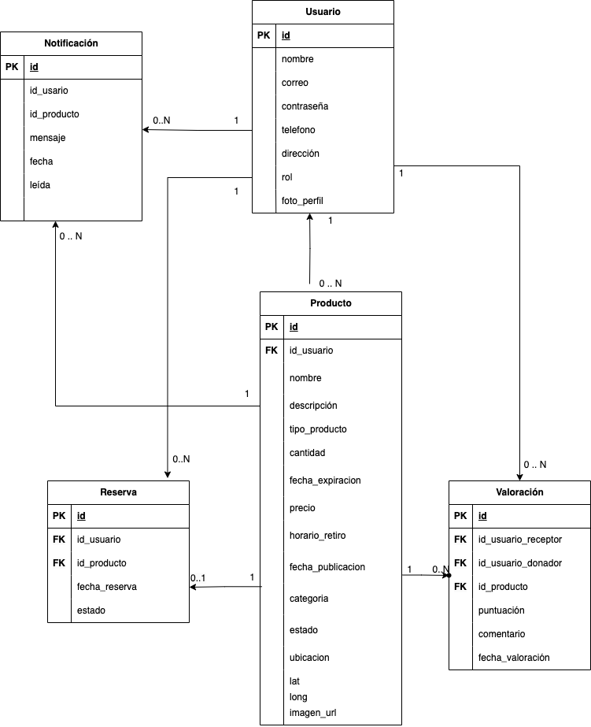
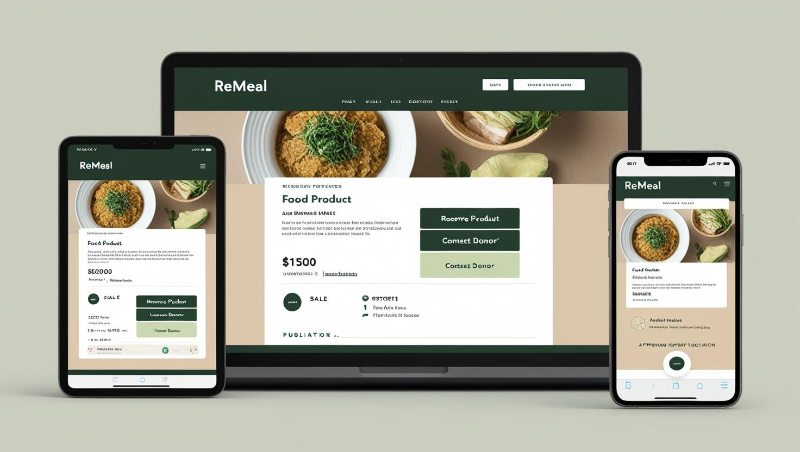
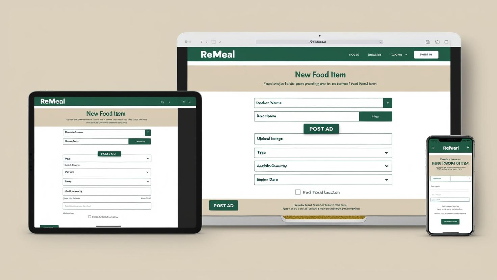
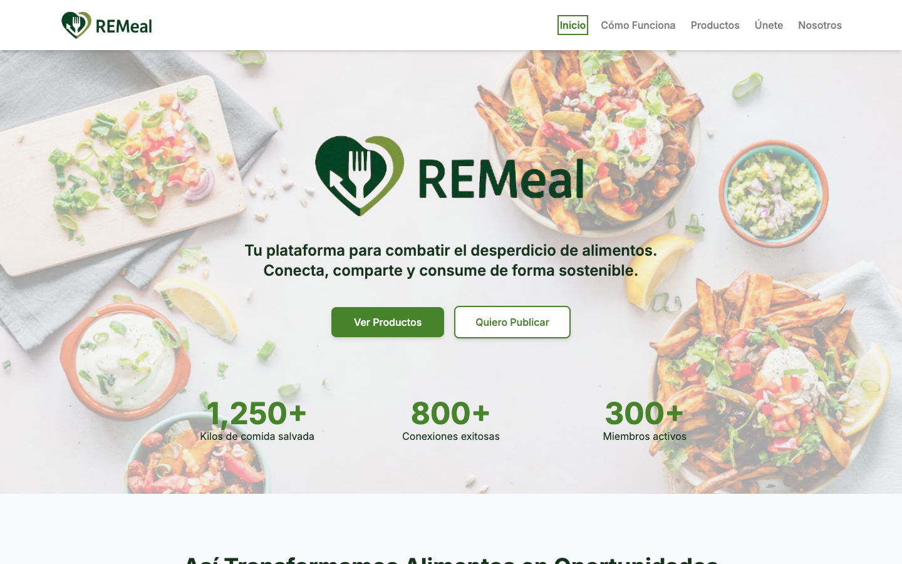
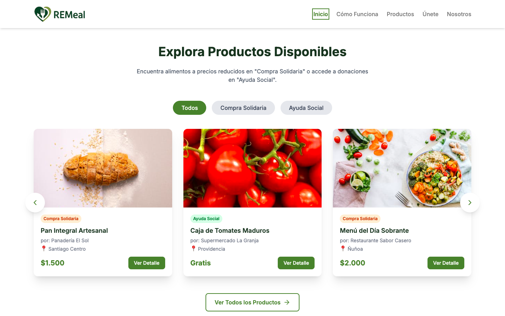
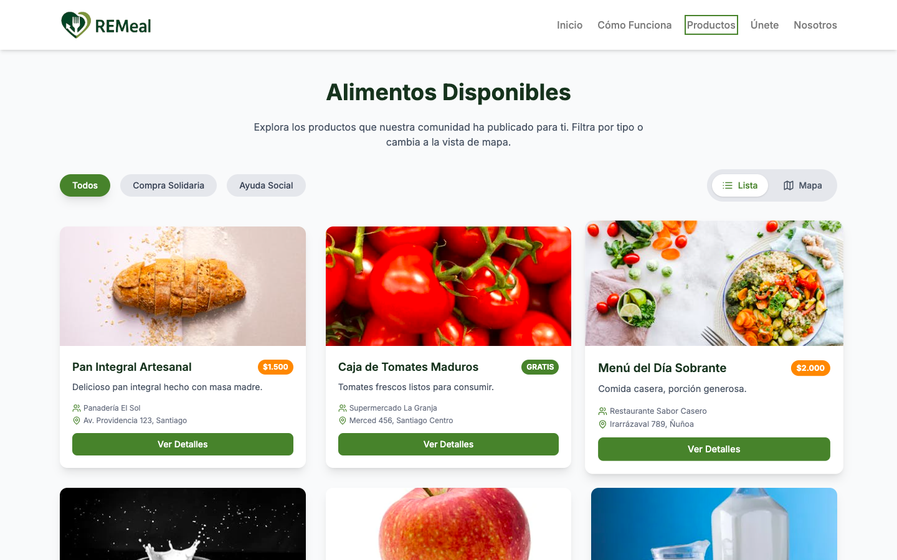
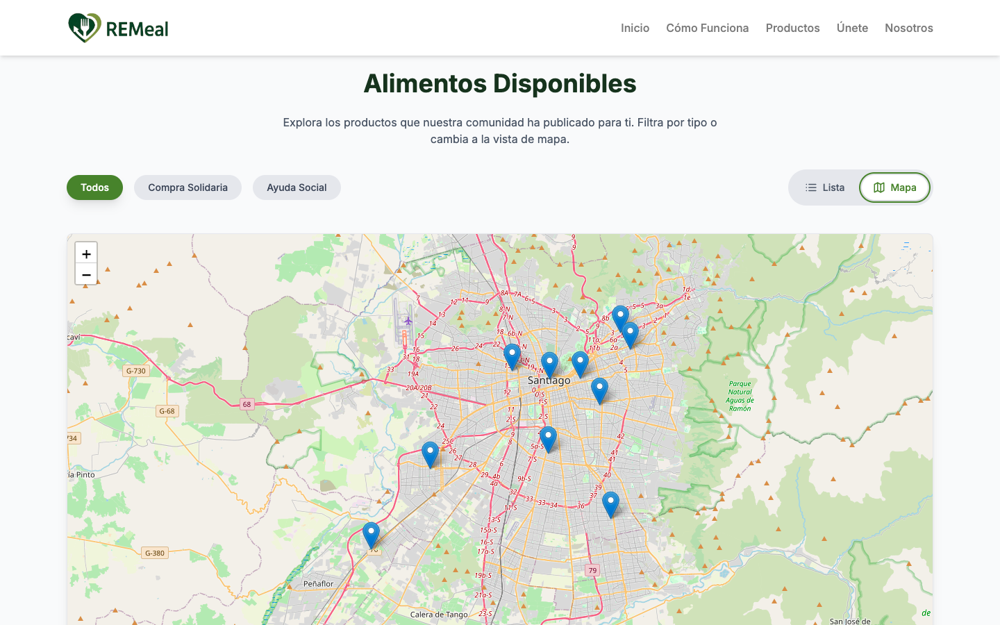
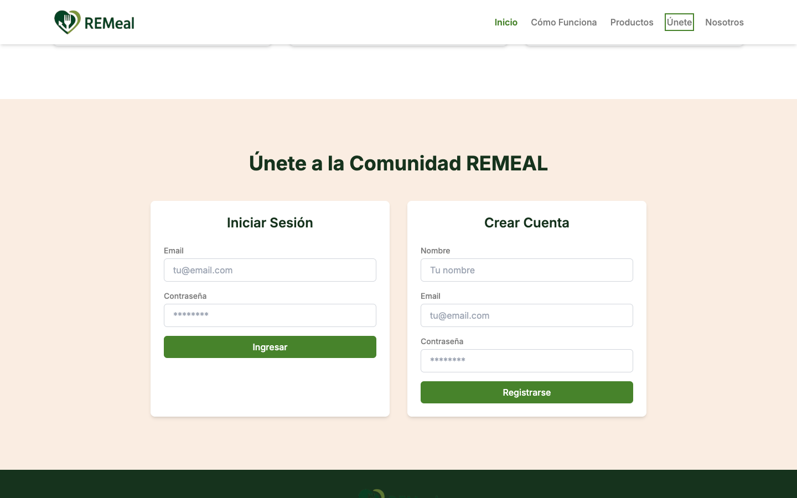

# E3 :construction:

* REMeal

## Link Deploy

https://gitboom-frontend.netlify.app/perfil

## Descripción general :thought_balloon:

- **¿De qué se tratará el proyecto?**  

 REMeal será una plataforma web solidaria tipo marketplace sostenible donde cualquier usuario —personas, supermercados, restaurantes, panaderías, fábricas de alimentos, entre otros— podrá publicar alimentos que estén próximos a vencer, sobrantes o imperfectos.
 La plataforma tendrá dos grandes secciones. Una sección es la Compra Solidaria: donde se podrán vender estos productos a precios reducidos. Por su parte también existe la sección Ayuda Social: donde se podrán donar productos a costo cero a fundaciones, organizaciones sociales o personas interesadas..
Adicionalmente, los productos que estén en venta pasarán automáticamente a la sección de Ayuda Social 24 horas antes de su vencimiento si no han sido vendidos, asegurando su rescate a tiempo.

- **¿Cuál es el fin o la utilidad del proyecto?**  

El proyecto REMeal busca reducir el desperdicio de alimentos en Chile, facilitando el acceso a productos asequibles o gratuitos para personas y organizaciones que lo necesiten. A través de su plataforma, se pretende crear una comunidad solidaria que incentive tanto la compra consciente como la ayuda social, fortaleciendo los lazos entre donantes y beneficiarios. Además, REMEAL permitirá visibilizar el impacto generado mediante métricas de alimentos salvados, donaciones realizadas y el reconocimiento a los usuarios más activos. De esta manera,con REMeal, la comida que antes se perdería podrá ser aprovechada, promoviendo un modelo de consumo más justo, sostenible y solidario.

- **¿Quiénes son los usuarios objetivo de su aplicación?**  
**a)** Personas particulares: que deseen donar, vender o comprar alimentos a precios justos.  
**b)** Comercios de alimentos: supermercados, restaurantes, panaderías, fábricas de alimentos que gestionen excedentes de forma responsable.  
**c)** Organizaciones sociales: fundaciones, hogares, comedores comunitarios que busquen alimentos en la sección de ayuda social.  
**d)** Equipo REMEAL: administradores encargados de validar usuarios, gestionar publicaciones y mantener el correcto funcionamiento de la plataforma.  


## Historia de Usuarios :busts_in_silhouette:

1. Como usuario donador (supermercado, restaurante o persona particular), quiero publicar productos excedentes en la plataforma, pudiendo elegir si los ofrezco en venta o donación, para evitar el desperdicio de alimentos.

2. Como donador, quiero publicar productos no vendidos o no usados, estableciendo un precio o donación gratuita, para compartir comida cocinada con personas o instituciones cercanas. antes de que se desperdicie.
3. Como usuario receptor, quiero visualizar productos disponibles en un mapa y por categorías (venta o ayuda social), para encontrar rápidamente los alimentos que necesito.
4. Como usuario donador, quiero agendar el horario disponible para el retiro de los alimentos que publique, para coordinar de manera más eficiente la entrega.
5. Como usuario, quiero recibir notificaciones cuando un producto pase automáticamente de venta a donación (24 horas antes de vencer), para aprovechar las oportunidades de alimentos gratuitos.
6. Como usuario receptor (fundación, comedor social o vecino), quiero reservar productos disponibles para asegurarme de retirarlos a tiempo antes de que expiren.
7. Como usuario receptor, quiero dejar valoraciones sobre los donadores después de recibir alimentos, para contribuir a la confianza y reputación en la plataforma.
8. Como administrador, quiero registrar automáticamente el impacto de cada donación (kilos salvados), para mostrar los resultados sociales y ambientales.
9. Como usuario donador, quiero poder ver el historial de mis donaciones y el impacto generado, para motivarme a seguir colaborando.
10. Como administrador, quiero que los productos que lleguen a su fecha de vencimiento sean eliminados automáticamente de la plataforma, para garantizar la calidad y seguridad alimentaria.
11. Como administrador, quiero generar rankings y métricas de usuarios más activos (tanto vendedores como donadores), para fomentar la participación y reconocer a los mejores contribuyentes de la comunidad.
12. Como usuario, quiero filtrar las publicaciones por cercanía, tipo de producto, precio o estado (venta o donación), para encontrar más rápido los alimentos que me interesan según mi necesidad.


## Diagrama Entidad-Relación :scroll:
<!-- Insertamos la imagen ER-Model.png -->


## Diseño Web :computer:

<!-- Documento de diseño web -->
### :art: Documento de diseño
1. Paleta de colores principales

2. Paleta de colores secundarios

3. Colores de alerta

4. Tipografía
Usaremos la tipografía **Inter** como tipografía principal. 
Con uso de distintos tamaños


<!-- Vistas principales -->
### :mag: Mock Up Vistas principales
1. Detalle Producto

2. Explorar Productos

3. Publicar Producto


<!-- Logo -->
### :art: Logo


### :mag: Vistas Principales
A continuacion se presentan algunas vistas principales como ejemplo de aplicación
1. Landing Page



2. About Us


3. Página de productos


4. Mapa


5. Formulario de registro


6. Cómo funciona


---

## Panel de Administrador

El panel de administrador permite gestionar toda la plataforma REMeal con las siguientes funcionalidades:

### Acceso al Panel
- Solo usuarios con rol de administrador pueden acceder
- Desde el perfil de usuario, aparece un botón "Dashboard" para admins
- URL: `/admin` (protegida)

### Credenciales de Administrador
Para acceder al panel de administrador, usa las siguientes credenciales:

**Email:** `admin@admin.com`  
**Contraseña:** `Admin1234!`

**Nota:** Estas credenciales las ponemos aca solo con el propósito de facilitar la corrección al ayudante. Sabemos que en un caso real no hay que hacer esto.


---

## Ejecución de tests automáticos (Selenium)

Para correr los tests automáticos de frontend (registro, login y publicación de producto):

1. **Asegúrate de tener la app corriendo en http://localhost:5173**
2. **Instala las dependencias necesarias:**
   ```bash
   npm install
   # o
   yarn install
   ```
3. **Compila el test Selenium:**
   ```bash
   npx tsc --project tsconfig.test.json
   ```
4. **Ejecuta el test:**
   ```bash
   node tests/selenium/dist/REMEALTests.cjs
   ```

- El test abrirá Chrome y automatizará el registro, login y publicación de un producto (incluyendo imagen).
- Puedes ver el flujo completo en el navegador (no es headless).
- El resultado aparecerá en la terminal.

**Requisitos:**
- Tener Google Chrome instalado
- Tener Chromedriver compatible (se instala automáticamente con selenium-webdriver)
- Node.js >= 16

**Notas:**
- El test usa la imagen `assets/pizza.png` para la publicación.
- Si quieres limpiar los usuarios/productos de prueba, hazlo desde el panel de admin o la base de datos.


